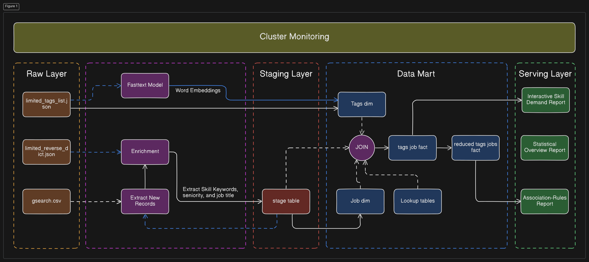

---
tags:
  - data-mining
  - python
  - airflow
  - sql
  - streamlit
  - NLP
---

📎 [Go Live](https://dataskillviz.streamlit.app/)

> [!warning]
> I’m on the **free tier** for both Streamlit and Aiven, If something goes wrong, it’s likely because they shut down my instances due to inactivity, contact me if that happens.

## Problem Statement

Recruiters tend to think differently than engineers. Engineers embrace the abstract science behind technology and tend to be tool-agnostic. On the other hand, recruiters often stay on the safe side and hire only for the tech stack their company works with.

Take SQL, for example. All data professionals excel at it, but recruiters might reject your résumé because they are looking for someone who has Snowflake listed, even though it’s still pure SQL.
Discover skill demand and related skills using FastText embeddings and cosine similarity. No fancy AI models required!
Quick Overview

>   

## Quick Overview
This analysis used [Luke Barousse’s public data-jobs dataset](https://www.kaggle.com/datasets/lukebarousse/data-analyst-job-postings-google-search) to train a FastText model that captures the semantic meaning of every tech skill in the corpus. The resulting embedding were then stored in a vector database to enable semantic search across tools in the data warehouse.

**Why to use semantic search in the first place?**
well, semantic search aims to understand the meaning and intent behind a search, while exact keyword search focuses more so on finding exact matches between the keywords in a query and the keywords in a document.

The other analysis involved an association-rules–type approach using a frequent pattern (FP) algorithm in data mining, which demonstrates how often tools and skill combinations are in demand, visualized as an interactive network graph.
>   

----

## Architecture, But Simplified
Analytical applications require four main stages: E for data extraction, T for data transformation, L for loading business-ready data, and V for visualization to report findings.

> 

These stages were accomplished by:

- **E:** Using custom Python scripts to acquire data from Kaggle into my staging area.

- **T:** Extracting skills using handwritten JSON lookups and enriching them with a custom FastText model to generate vector embeddings. The final step was applying an FP mining algorithm to uncover tool co-occurrence patterns across the dataset.

- **L:** Loading the results into a Postgres instance hosted on Aiven cloud, supported by the pgvector extension to enable semantic search.

- **V:** Streamlit and Plotly (Python) were used for this stage due to the heavy interactivity and customization that popular BI tools lack.

These steps were orchestrated using a standalone Apache Airflow cluster deployed with Docker Compose.

----

## Enhancements

Training and deploying FastText embeddings in production was challenging for three main reasons:
- **Dataset size was insufficient.** Luke’s dataset alone was too small, so DBpedia technical articles were added as a secondary corpus to enrich the vocabulary and improve embedding quality.

- **The trained model was relatively huge (~1.6 GB).** Hosting an API layer around it added unnecessary complexity and cost. After compression, the model shrank to 13 MB (~99% reduction) with no meaningful drop in accuracy.

- **Operational overhead had to stay minimal.** The compressed model is fetched directly from a GitHub repository, cached for a while, and then released, keeping production lightweight and cheap.

---

### Project Deliverables

- Fully automated data pipeline for extracting, cleaning, enriching, and loading job-market data.

- FastText embedding model (compressed version included) trained on combined corpus of job postings + DBpedia technical articles.

- Vector-search–enabled Postgres database using pgvector for semantic retrieval of tools and skills.

- Frequent Pattern Mining outputs showing co-occurrence patterns across tech skills in U.S. job postings.