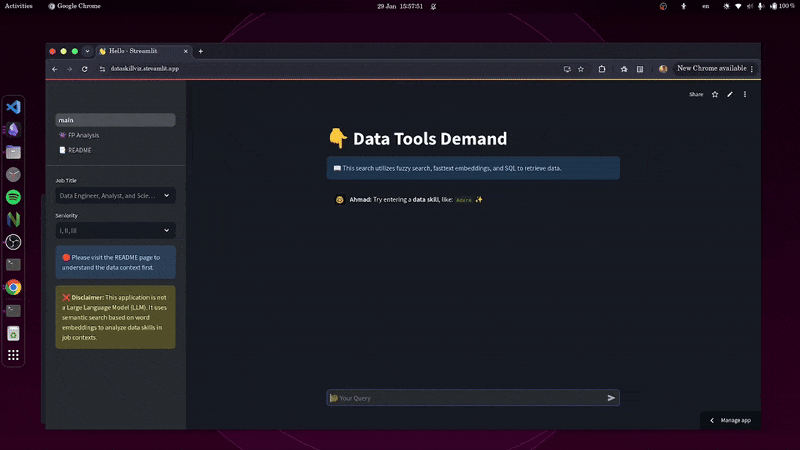
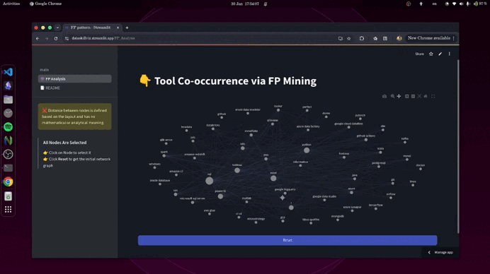

---
tags:
  - data-mining
  - python
  - airflow
  - sql
  - streamlit
  - NLP
---

📎 [Go Live](https://dataskillviz.streamlit.app/)

>   

**Impact:**
- Engineering market-aligned skill visibility without chasing hype.
- Navigate recruiter filters and ATS screens.

**Why:**  
- Recruiters and engineers think differently. 
- Engineers value fundamentals, problem-solving, and tool-agnostic approaches.
- recruiters filter for current tool-sets and measurable impact. 
- This gap amplified by automated resume screening, hurts juniors the most.

**What:**  
- Analyzed 40k+ job postings and 400+ data-related tools to map tool demand and co-occurrence patterns. 

**How:**  
- **Ingest:** [Data Analyst job posting](https://www.kaggle.com/datasets/lukebarousse/data-analyst-job-postings-google-search) + Airflow → Postgres (Aiven). 
- **Modeling:** Kimball star schema + fastText embeddings for semantic skill similarity.  
- **UX:** Streamlit app with tool demand charts and association graphs.  
>   

> [!warning]
> I’m on the **free tier** for both Streamlit and Aiven, If something goes wrong, it’s likely because they shut down my instances due to inactivity, contact me if that happens.